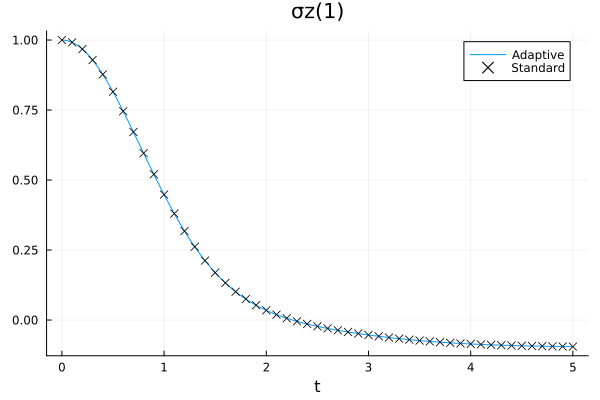
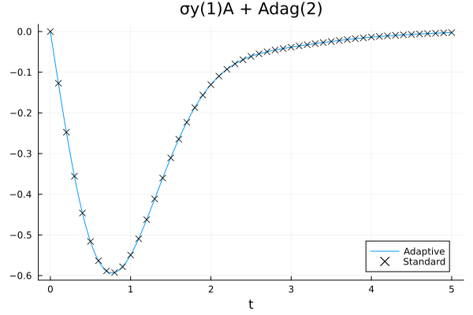
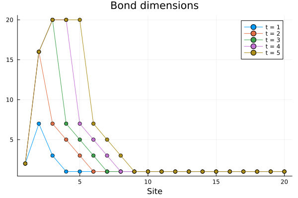

# Adaptive TDVP1

The TDVP1 algorithm features a _fixed_ bond dimension, that is, the size of the
MPS does not increase during the time evolution. As such, the bond dimensions
must be chosen before starting the algorithm, which means that we need to
estimate them beforehand, or repeat the simulation with a higher dimension
enough times until the results converge.
The _adaptive_ TDVP1 algorithm is a modification of the original TDVP1 which is
capable of increasing the bond dimensions during the evolution, using a
subspace-expansion technique.  This algorithm is implemented in the
`adaptivetdvp1!` function, which follows [Dunnett2021:adaptive_tdvp1](@cite).

```@docs; canonical=false, collapsed=true
adaptivetdvp1!
adaptivetdvp1vec!
adaptiveadjtdvp1vec!
```

!!! info "Adaptive variants"
    This package implements an adaptive variant for the `tdvp1!`, `tdvp1vec!`,
    `adjtdvp1vec!` functions.  They all work in the same way with respect to the
    original (non-adaptive) version of the algorithm, therefore in this tutorial
    we will focus only on the first one.

Let's test this function on a simple physical model, a spin coupled to a bosonic
bath

```math
\begin{gather*}
H = H\Sys + H\Env + H\Int,\\
H\Sys = \frac{\omega_0}{2} \sigma_z,\\
H\Env = \int_0^{\omega\cutoff} \adj{a_\omega} a_\omega\phantomadj\,\dd\omega,\\
H\Int = \sigma_x \otimes \int_0^{\omega\cutoff}
        (a_\omega\phantomadj + \adj{a_\omega}) \sqrt{J(\omega)} \,\dd\omega,
\end{gather*}
```

with an Ohmic spectral density function \\(J(\omega) = 2\pi \alpha \omega\\) on
\\([0,\omega\cutoff]\\), and the spin starting from the up state the bosons from
thermal equilibrium:

```math
\rho_0 = \proj{\spinup} \otimes \frac{1}{\exp(-\beta H\Env)} \exp(-\beta H\Env).
```

We transform this system into a form which is more suitable to the MPS
formalism with a _chain-mapping_ algorithm, specifically T-TEDOPA, that
replaces such a continuous environment into a discrete, linear chain of bosonic
modes: we obtain a new Hamiltonian

```math
\begin{gather*}
H' = H\Sys + H'\Env + H'\Int,\\
H'\Env = \sum_{n=1}^{+\infty} \adj{A_n} A_n\phantomadj
         +\sum_{n=1}^{+\infty} (
            \adj{A_n} A_{n+1}\phantomadj
            +\adj{A_{n+1}} A_n\phantomadj
         ),\\
H'\Int = \sigma_x \otimes (A_1 + \adj{A_1})
\end{gather*}
```

such that the open-system dynamics of the spin is the same.
We'll use the [TEDOPA](https://github.com/phaerrax/TEDOPA.jl) package to compute
the chain mapping, and truncate the infinite chain to \\(N=20\\) sites.

```jldoctest atdvp1; setup = :(using TEDOPA)
julia> N = 20;

julia> envdict = Dict(
             "environment" => Dict(
                 "spectral_density_parameters" => [],
                 "spectral_density_function" => "0.2 * x",
                 "domain" => [0, 1],
                 "temperature" => 1,
             ),
             "chain_length" => N,
             "PolyChaos_nquad" => 200,
         );

julia> env = chainmapping_ttedopa(envdict);
```

Now we define the Hamiltonian operators and the initial state, which for the
bosonic bath, after the T-TEDOPA transformation, is the vacuum.

```jldoctest atdvp1; setup =:(using ITensorMPS, MPSTimeEvolution)
julia> s = [siteind("S=1/2"); siteinds("Boson", N; dim=8)];

julia> h = OpSum();

julia> h += 0.1, "σz", 1;

julia> h += couplings(env)[1], "σx", 1, "A + Adag", 2;

julia> for n in 1:N
           h += frequencies(env)[n], "N", n+1
       end

julia> for n in 1:N-1
           h += couplings(env)[n+1], "Adag", n+1, "A", n+2
           h += couplings(env)[n+1], "Adag", n+2, "A", n+1
       end

julia> H = MPO(h, s);

julia> ρₜ_adapt = MPS(s, n -> n == 1 ? "Up" : "0");
```

We also set the time step and the total evolution time:

```jldoctest atdvp1
julia> dt = 0.01; tmax = 5;
```

We want to observe the evolution of the magnetisation on the spin, and the heat
flow between the spin and the heat bath, for which we need to measure the
\\(\sigma\sb{y} \otimes (A\sb1 + \adj{A\sb1})\\) observable.

```jldoctest atdvp1
julia> cb_adapt = ExpValueCallback("σz(1),σy(1)A + Adag(2)", s, dt)
ExpValueCallback
Operators: σz(1) and σy(1)A + Adag(2)
No measurements performed

```

Let's call the `adaptivetdvp1!` method and start the time evolution. The
precision of the bond-dimension-adaptation routine is set by the
`convergence_factor_bonddims` keyword argument, that we'll set to `1e-5`.
The `maxbonddim` argument controls instead the maximum allowed bond dimension,
after which the adaptive algorithm will stop making the bond dimensions larger.
We store the information about the bond dimension on an external file, so that
we can recall it later.

```jldoctest atdvp1
julia> bdim_file, _ = mktemp();

julia> adaptivetdvp1!(ρₜ_adapt, H, dt, tmax; callback=cb_adapt, convergence_factor_bonddims=1e-5, maxbonddim=20, progress=false, io_ranks=bdim_file)
```

For comparison, we also run a standard TDVP1 evolution, with the bond dimension
set to the maximum of the adaptive algorithm.

```jldoctest atdvp1
julia> ρₜ = MPS(s, n -> n == 1 ? "Up" : "0");

julia> ρₜ = enlargelinks(ρₜ, 20);

julia> cb = ExpValueCallback("σz(1),σy(1)A + Adag(2)", s, dt);

julia> tdvp1!(ρₜ, H, dt, tmax; callback=cb, progress=false);
```





The results are comparable with a moderate amount of resources (numerically, the
observed expectation values differ by about \\(10^{-4}\\) at the end of the
evolution).  We can also check how the bond dimensions actually change during
the evolution by plotting the contents of the output file:



Only the sites closer to the spin, that are the only ones to be significantly
perturbed away from thermal equlibrium, see their bond dimensions increase,
until they hit the maximum allowed value of 20.
