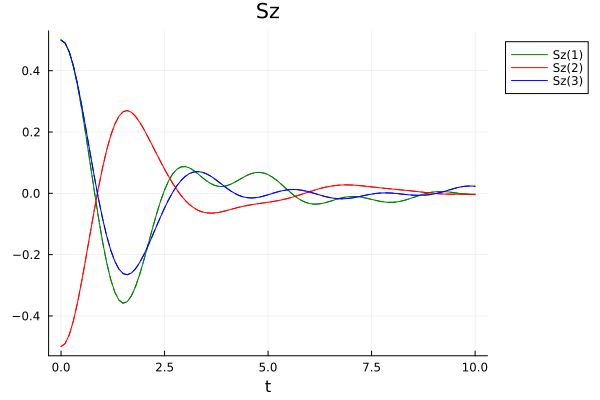
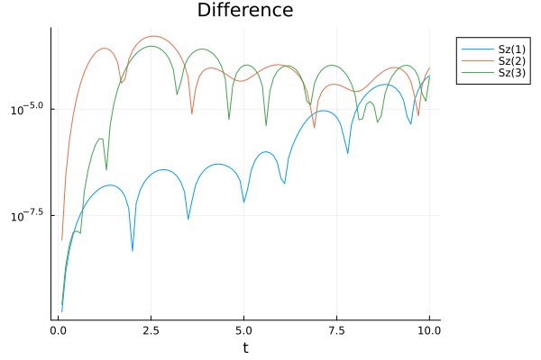

# Time-evolving block decimation

The time-evolving block-decimation (TEBD) algorithm, introduced in
[Vidal2004:tebd](@cite) is the ideal time-evolution scheme to simulate
one-dimensional many-body systems that are characterised by at most
nearest-neighbour interactions.
With the quantum state encoded in a Vidal-form MPS, the TEBD algorithm can be
straightforwardly parallelised due to the Suzuki–Trotter decomposition of the
time-evolution operator.

The MPSTimeEvolution package offers two variants of TEBD that differ in the
order of the Suzuki-Trotter decomposition used for the time-evolution operator.

Before we begin, let's introduce some objects we will need in both cases.
We'll use the same initial pure state and Hamiltonian as in the [Standard
TDVP1](@ref) example:

```math
\ket{\psi_0} = \ket{\spinup} \otimes \ket{\spindown} \otimes \ket{\spinup}
\otimes \ket{\spindown} \otimes \dotsb {}
```

and

```math
H = -\frac12 \sum_{n=1}^{N-1} \pauliz[n] \pauliz[n+1] +\sum_{n=1}^{N} \paulix[n]
```

```jldoctest tdvp1
julia> using ITensorMPS, MPSTimeEvolution

julia> N = 10; s = siteinds("S=1/2", N);

julia> ψₜ = VidalMPS(s, n -> isodd(n) ? "↑" : "↓");

julia> h = OpSum();

julia> for n in 1:N
           h += "σx", n
       end

julia> for n in 1:N-1
           h += -0.5, "σz", n, "σz", n+1
       end

```

We also choose the time step and the total evolution time

```jldoctest tdvp1
julia> dt = 0.01; tmax = 10;

```

We define a callback object to track the \\(z\\)-axis magnetisation on the first
three sites.  By setting the last argument to `10dt`, the expectation values
will be computed only every tenth time step.

```jldoctest tdvp1
julia> cb = ExpValueCallback("Sz(1,2,3)", s, 10dt)
ExpValueCallback
Operators: Sz(1), Sz(2) and Sz(3)
No measurements performed

```

## First-order Suzuki-Trotter decomposition

```@docs; canonical=false, collapsed=true
tebd1!
```

The `tebd1!` function evolves the `VidalMPS` `ψₜ` according to the specified
Hamiltonian. It is enough to specfy the (full) Hamiltonian operator as an
`OpSum` object: the `tebd1!` function will take care of computing the
Suzuki-Trotter decomposition in odd and even terms.

!!! info "Suzuki-Trotter decomposition"
    In the decomposition, a single-site operators \\(h_k\\) on site \\(k\\) is
    split simmetrically between the evolution operator on sites \\((k-1,k)\\)
    and \\((k, k+1)\\).
    As of the time this guide was written, the Hamiltonian provided to the TEBD
    function (as an `OpSum`) can admit only single-site or nearest-neighbour
    two-site operators. Specifically, interaction between non-nearest-neighbour
    sites are not allowed.

We need to provide the `maxdim` and `cutoff` keyword argument in order to
describe how the MPS has to be truncated after the application of the two-site
time-evolution operators.

```jldoctest tdvp1
julia> tebd1!(ψₜ, h, dt, tmax; cutoff=1e-12, maxdim=10, progress=false, callback=cb)

```

## Second-order Suzuki-Trotter decomposition

The interface of the TEBD function with the second-order Suzuki-Trotter
algorithm is exactly the same as `tebd1!`.

```@docs; canonical=false, collapsed=true
tebd2!
```

In the second-order Suzuki-Trotter decomposition, the time-evolution operator
over a time step \\(t\\) is

```math
U(t) = U_{odd}(t/2) U_{even}(t) U_{odd}(t/2);
```

if we don't need to compute the expectation values in `cb` after each time step,
we can merge the \\(U\sb{odd}(t/2)\\) in the \\(U(t)\\) across time steps, i.e.

```math
U(t)^k = U_{odd}(t/2) U_{even}(t) \bigl(U_{odd}(t) U_{even}(t)\bigr)^{k-1} U_{odd}(t/2)
```

which avoids some tensor multiplications and unnecessary SVDs.
This is automatically done by the `tebd2!` function if the measurement time step
saved in the callback object is equal to \\(k>1\\) times the time step `dt`.

Let's run the function, after resetting the state to its initial value, and
creating a new callback object:

```jldoctest tdvp1
julia> ψₜ = VidalMPS(s, n -> isodd(n) ? "↑" : "↓");

julia> cb2 = ExpValueCallback("Sz(1,2,3)", s, 10dt);

julia> tebd2!(ψₜ, h, dt, tmax; cutoff=1e-12, maxdim=10, progress=false, callback=cb2)

```

We can see the results in the pictures below: the TEBD1 results are represented
by dashed lines, and the TEDB2 results by solid lines.  We find, as expected,
that the two algorithm produce approximately the same results, which differ by
approximately \\(10^{-5}\\) at the end of the run (which is fine, since we
haven't been that careful to set up a numerical simulation with sensible
parameters).



